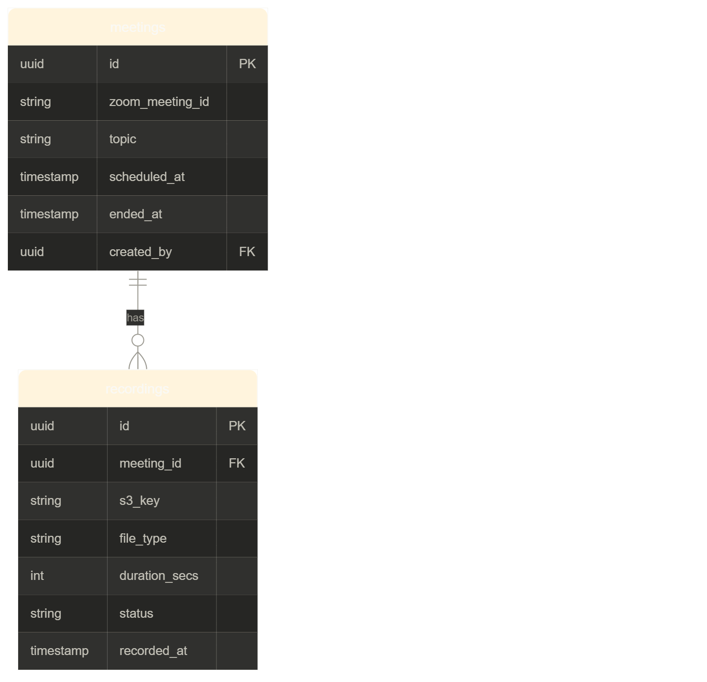

Great question. Let me break this into two parts — the data model first, then the API routes.

---

## The data model

Your S3 already stores the files, but your **database** needs to track them so your frontend can list, display and delete them efficiently. You don't want to hit S3 every time someone opens the calendar.Here's the DB schema you need, then all the backend routes, then the frontend code.One `meeting` can have **multiple recordings** (for abrupt endings). The `s3_key` stores the exact path in S3 so you never need to hit S3 just to list recordings — you just query your DB.



The `status` field on recordings can be `processing`, `ready`, or `deleted` — this lets you show a "Processing..." state on the frontend while the Lambda is still downloading from Zoom.

---

## Backend routes

All three things you need — list, stream, delete — in one file:

```js
// routes/recordings.js
import { Router } from 'express';
import { getSignedUrl } from '@aws-sdk/cloudfront-signer';
import { S3Client, DeleteObjectsCommand } from '@aws-sdk/client-s3';

const router = Router();
const s3 = new S3Client({ region: 'ap-south-1' });

// ─── 1. LIST recordings for a meeting ───────────────────────────────────────
// Called by calendar / past schedule page
// GET /api/meetings/:meetingId/recordings
router.get('/:meetingId/recordings', authenticate, async (req, res) => {
  const { meetingId } = req.params;

  const { rows } = await db.query(
    `
    SELECT
      r.id,
      r.file_type,
      r.duration_secs,
      r.status,
      r.recorded_at,
      m.topic,
      m.scheduled_at
    FROM recordings r
    JOIN meetings m ON m.id = r.meeting_id
    WHERE m.zoom_meeting_id = $1
      AND r.status != 'deleted'
    ORDER BY r.recorded_at ASC
  `,
    [meetingId],
  );

  // Students only see recordings of meetings they attended
  if (req.user.role === 'student') {
    const attended = await db.query(
      'SELECT 1 FROM meeting_participants WHERE meeting_id=$1 AND user_id=$2',
      [meetingId, req.user.id],
    );
    if (!attended.rows.length)
      return res.status(403).json({ error: 'Access denied' });
  }

  res.json({ recordings: rows });
});

// ─── 2. GET stream URL for one recording ────────────────────────────────────
// Called when user clicks play on a specific recording
// GET /api/recordings/:recordingId/stream
router.get('/:recordingId/stream', authenticate, async (req, res) => {
  const { rows } = await db.query(
    `
    SELECT r.*, m.zoom_meeting_id
    FROM recordings r
    JOIN meetings m ON m.id = r.meeting_id
    WHERE r.id = $1 AND r.status = 'ready'
  `,
    [req.params.recordingId],
  );

  if (!rows.length)
    return res.status(404).json({ error: 'Recording not found' });
  const recording = rows[0];

  // Student access check
  if (req.user.role === 'student') {
    const attended = await db.query(
      'SELECT 1 FROM meeting_participants WHERE meeting_id=$1 AND user_id=$2',
      [recording.meeting_id, req.user.id],
    );
    if (!attended.rows.length)
      return res.status(403).json({ error: 'Access denied' });
  }

  const signedUrl = getSignedUrl({
    url: `https://${process.env.CLOUDFRONT_DOMAIN}/${recording.s3_key}`,
    keyPairId: process.env.CLOUDFRONT_KEY_PAIR_ID,
    privateKey: process.env.CLOUDFRONT_PRIVATE_KEY.replace(/\\n/g, '\n'),
    dateLessThan: new Date(Date.now() + 2 * 60 * 60 * 1000).toISOString(),
  });

  res.json({
    url: signedUrl,
    fileType: recording.file_type,
    duration: recording.duration_secs,
  });
});

// ─── 3. DELETE a recording (Operations only) ────────────────────────────────
// DELETE /api/recordings/:recordingId
router.delete(
  '/:recordingId',
  authenticate,
  requireRole('operations'),
  async (req, res) => {
    const { rows } = await db.query(
      'SELECT * FROM recordings WHERE id = $1 AND status != $2',
      [req.params.recordingId, 'deleted'],
    );

    if (!rows.length)
      return res.status(404).json({ error: 'Recording not found' });
    const recording = rows[0];

    // Delete from S3
    await s3.send(
      new DeleteObjectsCommand({
        Bucket: process.env.S3_BUCKET,
        Delete: { Objects: [{ Key: recording.s3_key }] },
      }),
    );

    // Soft delete in DB — keeps audit trail
    await db.query('UPDATE recordings SET status = $1 WHERE id = $2', [
      'deleted',
      recording.id,
    ]);

    res.json({ success: true });
  },
);

export default router;
```

Register in `app.js`:

```js
import recordingsRouter from './routes/recordings.js';
app.use('/api/recordings', recordingsRouter);
app.use('/api/meetings', meetingsRouter); // your existing meetings router
```

Also update your Lambda webhook handler to save to DB when it finishes downloading:

```js
// At the end of your Lambda handler, after uploading to S3:
await fetch(`${process.env.APP_URL}/internal/meetings/${uuid}/recordings`, {
  method: 'POST',
  headers: {
    'Content-Type': 'application/json',
    'x-internal-secret': process.env.INTERNAL_SECRET,
  },
  body: JSON.stringify({
    files: recording_files.map((f) => ({
      s3Key: `recordings/${uuid}/${f.file_type.toLowerCase()}_${f.id}.mp4`,
      fileType: f.file_type,
      recordedAt: f.recording_start,
    })),
  }),
});
```

And add this internal route to your Express app (not exposed to users):

```js
app.post(
  '/internal/meetings/:meetingId/recordings',
  internalAuth,
  async (req, res) => {
    const { meetingId } = req.params;
    const { files } = req.body;

    // Find the meeting in your DB by zoom_meeting_id
    const {
      rows: [meeting],
    } = await db.query('SELECT id FROM meetings WHERE zoom_meeting_id = $1', [
      meetingId,
    ]);
    if (!meeting) return res.status(404).json({ error: 'Meeting not found' });

    // Insert each recording file
    for (const file of files) {
      await db.query(
        `
      INSERT INTO recordings (meeting_id, s3_key, file_type, status, recorded_at)
      VALUES ($1, $2, $3, 'ready', $4)
    `,
        [meeting.id, file.s3Key, file.fileType, file.recordedAt],
      );
    }

    res.json({ success: true });
  },
);
```

---

## Frontend — calendar / past schedule list

```jsx
// PastSchedule.jsx
function PastSchedule() {
  const [meetings, setMeetings] = useState([]);

  useEffect(() => {
    fetch('/api/meetings/past', {
      headers: { Authorization: `Bearer ${getToken()}` },
    })
      .then((r) => r.json())
      .then(({ meetings }) => setMeetings(meetings));
  }, []);

  return (
    <div>
      {meetings.map((meeting) => (
        <MeetingCard key={meeting.id} meeting={meeting} />
      ))}
    </div>
  );
}

function MeetingCard({ meeting }) {
  const [recordings, setRecordings] = useState(null);
  const [expanded, setExpanded] = useState(false);

  const loadRecordings = async () => {
    if (recordings) return; // already loaded
    const { recordings: recs } = await fetch(
      `/api/meetings/${meeting.zoom_meeting_id}/recordings`,
      { headers: { Authorization: `Bearer ${getToken()}` } },
    ).then((r) => r.json());
    setRecordings(recs);
  };

  return (
    <div
      onClick={() => {
        setExpanded(!expanded);
        loadRecordings();
      }}
    >
      <h3>{meeting.topic}</h3>
      <p>{new Date(meeting.scheduled_at).toLocaleDateString('en-IN')}</p>

      {expanded && recordings && (
        <div>
          {recordings.length === 0 && <p>No recordings available</p>}

          {recordings.map((rec, i) => (
            <RecordingRow
              key={rec.id}
              recording={rec}
              label={recordings.length > 1 ? `Part ${i + 1}` : 'Recording'}
            />
          ))}
        </div>
      )}
    </div>
  );
}

function RecordingRow({ recording, label }) {
  const [streamUrl, setStreamUrl] = useState(null);
  const user = useCurrentUser();

  const handlePlay = async () => {
    const { url } = await fetch(`/api/recordings/${recording.id}/stream`, {
      headers: { Authorization: `Bearer ${getToken()}` },
    }).then((r) => r.json());
    setStreamUrl(url);
  };

  const handleDelete = async () => {
    if (!confirm('Delete this recording? This cannot be undone.')) return;
    await fetch(`/api/recordings/${recording.id}`, {
      method: 'DELETE',
      headers: { Authorization: `Bearer ${getToken()}` },
    });
    // refresh parent
  };

  if (recording.status === 'processing') {
    return <p>{label} — Processing...</p>;
  }

  return (
    <div>
      <span>
        {label} · {Math.round(recording.duration_secs / 60)} min
      </span>
      <button onClick={handlePlay}>Play</button>
      {user.role === 'operations' && (
        <button onClick={handleDelete} style={{ color: 'red' }}>
          Delete
        </button>
      )}
      {streamUrl && (
        <video
          controls
          autoPlay
          src={streamUrl}
          style={{ width: '100%', marginTop: 8 }}
        />
      )}
    </div>
  );
}
```

---

## How the "multiple recordings" case looks to the user

When a meeting is cut short and resumed, Zoom creates two separate recording files. Your Lambda downloads both, your DB stores both rows linked to the same `meeting_id`, and your frontend shows them as "Part 1" and "Part 2" under the same meeting card. In the normal case there's just one, so the label is just "Recording" with no number.
